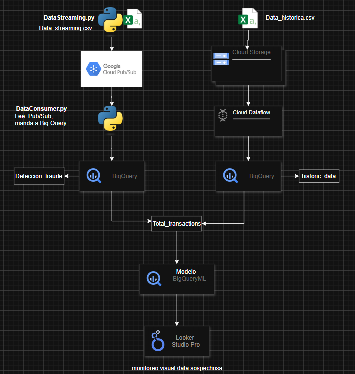

# 🔍 Arquitectura de Detección de Fraudes en GCP (Batch + Streaming + ML)

## 📘 Descripción
Este repositorio contiene los scripts y configuraciones para un sistema de detección de fraudes financieros utilizando tecnologías de Google Cloud Platform (GCP). El sistema combina procesamiento **streaming** y **batch**, junto con un modelo de machine learning implementado con **BigQuery ML**.

---

## 📌 Arquitectura General

Este pipeline aprovecha múltiples servicios de GCP para implementar una arquitectura Lambda (Batch + Streaming) que detecta fraudes en tiempo real, entrena modelos de machine learning, y presenta resultados visuales en dashboards interactivos.

 

---

## 🧰 Servicios Utilizados y Descripción


### 1. GCS
**Descripción**: Servicio de almacenamiento.  
**Uso en el proyecto**: Se almacena la data historica del banco en un bucket.  

---
### 2. Pub/Sub
**Descripción**: Sistema de mensajería en tiempo real que permite transmitir transacciones financieras para su procesamiento inmediato.  
**Uso en el proyecto**: El script `dataStreaming.py` simula transacciones financieras y las envía a un tópico de Pub/Sub.  

---

### 3. Data Flow
**Descripción**: Funciones serverless que procesan eventos de Pub/Sub.  
**Uso en el proyecto**: Procesamiento Batch desde el Bucket de GCS para data Historica, luego almacena a BigQuery.  
**Ventaja**: Bajo costo, escalado automático, ideal para tareas ligeras y asincrónicas.

---

### 4. BigQuery
**Descripción**: Almacén de datos serverless para análisis de grandes volúmenes.
**Uso en el Proyecto**: El script `dataConsumer.py` obtiene todos los datos en tiempo real desde el Subscriptor de Pub/Sub creando alertas y los almacena a BigQuery
**Tablas utilizadas**:
- `deteccionFraude`: Recibe datos en tiempo real desde Pub/Sub.
- `historic_transactions`: Datos históricos usados para entrenar el modelo.
- `transactions_totales`: Unión de ambos conjuntos para consulta y evaluación del modelo.  
**Costo estimado**:
- Almacenamiento: ~$0.02/GB al mes.
- Consultas: ~$5/TB (primer TB/mes gratuito).

---

### 5. BigQuery ML
**Descripción**: Entrenamiento de modelos de machine learning directamente con SQL.  
**Uso en el proyecto**: Entrena un modelo de clasificación para detectar fraudes (`CREATE MODEL` con `LOGISTIC_REG`).  
**Automatización**: Mediante **Scheduled Queries** para volver a entrenar el modelo cada cierto tiempo.

---

### 5. Looker Studio
**Descripción**: Herramienta de visualización gratuita integrada con BigQuery.  
**Uso en el proyecto**: Dashboard con métricas de fraude, predicciones, y volumen de transacciones en tiempo real. Útil para monitoreo de fraudes y transacciones de alto riesgo

---

## ⚙️ Configuración GCP

### Requisitos

- Cuenta en GCP con facturación activa.
- Proyecto con los siguientes servicios habilitados:
  - Cloud Storage
  - Pub/Sub
  - BigQuery
  - Data Flow
  - Looker Studio

---

## 🚀 Ejecución de Scripts

### 1. Simular Envío de Transacciones

`dataStreaming.py` esto envía datos al tópico de **Pub/Sub** en tiempo real.

### 2. Procesar Mensajes desde Pub/Sub

`dataConsumer.py` procesa cada vez que llega un nuevo mensaje.

### 3. Crear Tabla Unificada en BigQuery

```sql
CREATE OR REPLACE TABLE fraud_detection.transactions_totales AS
SELECT * FROM fraud_detection.deteccionFraude
UNION ALL
SELECT * FROM fraud_detection.historic_transactions;
```

### 4. Entrenar Modelo en BigQuery ML

```sql
CREATE OR REPLACE MODEL fraud_detection.fraud_model
OPTIONS(model_type='logistic_reg') AS
SELECT *, CAST(is_fraud AS INT64) AS label
FROM fraud_detection.transactions_totales;
```

### 5. Hacer Predicciones

```sql
SELECT *, predicted_label, predicted_probability
FROM ML.PREDICT(MODEL fraud_detection.fraud_model,
     (SELECT * FROM fraud_detection.transactions_streaming));
```

### 6. Automatizacion de Entrenamiento (Scheduled Query)

Se entrena el modelo cada 24 horas para actualizar el modelo con nueva data historica.
Se realizan las predicciones cada 2 horas a partir de transacciones_totales.

---

## 📊 Visualización

En **Looker Studio**

Se conecta la tabla `fraud_detection.transactions_totales`

Se crean visualizaciones como:

- % de fraudes detectados
- Monto promedio de transacciones fraudulentas
- Predicciones recientes en tiempo real

---

## 💡 Ideas para Escalar

- Implementar autenticación y autorización para el envío de datos.
- Añadir validaciones de schema en Pub/Sub.
- Incrementar complejidad del modelo (XGBoost con Vertex AI).
- Monitorear en tiempo real con Cloud Monitoring.
- Integrar alertas (fraudes detectados) con Cloud Functions → Slack, correo o SMS.

---

## 🔗 Recursos útiles

- [BigQuery ML](https://cloud.google.com/bigquery-ml)
- [Google Cloud Pub/Sub](https://cloud.google.com/pubsub)
- [Looker Studio](https://lookerstudio.google.com/)
- [Scheduled Queries en BigQuery](https://cloud.google.com/bigquery/docs/scheduling-queries)

